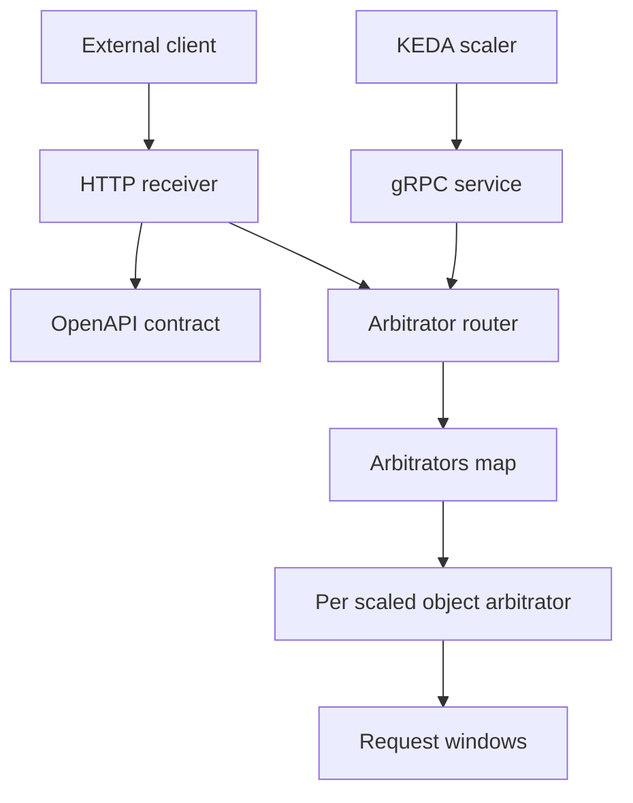
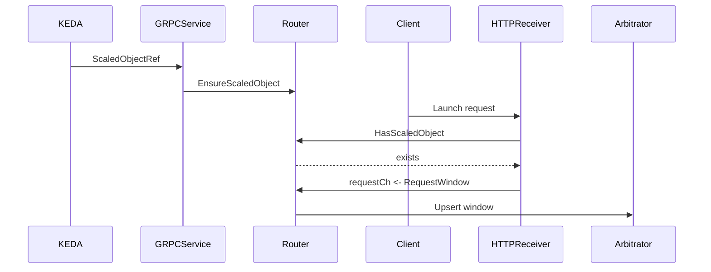
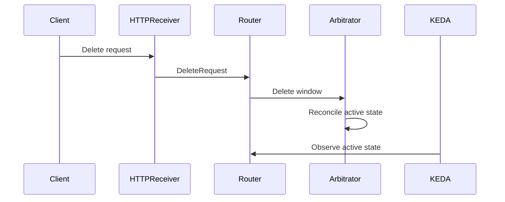

# Design Document

## Overview
この feature は、HTTP receiver に 3 つの小さな拡張を追加する。既存 `POST /requests` は対象 ScaledObject の存在を確認してから request を受理し、HTTP API は ScaledObject 一覧取得と request 削除を提供する。

ScaledObject の存在は Kubernetes API ではなく、KEDA external scaler gRPC から受け取った valid `ScaledObjectRef` によって router の `arbitrators` map に作成された key を source とする。この spec では request list/get API は扱わない。

### Goals
- `POST /requests` で unknown ScaledObject を受理しない。
- HTTP API で ScaledObject 一覧を取得できる。
- HTTP API で request ID を指定して request を削除できる。
- delete 後の active state を KEDA から観測できる状態に反映する。

### Non-Goals
- request 一覧取得、request 個別取得。
- Kubernetes API server への問い合わせ、RBAC、cluster resource cache。
- 認証、認可、audit log。
- request state の永続化と service restart 後の復元。
- KEDA external scaler gRPC API contract の変更。

## Boundary Commitments

### This Spec Owns
- 既存 `POST /requests` の ScaledObject existence check。
- HTTP receiver API の ScaledObject 一覧 endpoint。
- HTTP receiver API の request 削除 endpoint。
- router/arbitrator が保持する in-memory request window の delete behavior。
- project-provided client の ScaledObject 一覧・request 削除 API。
- OpenAPI 生成コード更新と repo-owned behavior tests。

### Out of Boundary
- request list/get API。
- Kubernetes API を使った ScaledObject 実在確認。
- ScaledObject registry 用の別 storage または別 map。
- request 履歴、監査、削除済み request の参照。
- HTTP readiness endpoint や health endpoint。
- KEDA gRPC protobuf の拡張。

### Allowed Dependencies
- `internal/common/contracts/receivers/http/openapi.yaml` を HTTP contract の source of truth とする。
- `oapi-codegen` generated server/client を既存 config で更新する。
- HTTP receiver は router の管理 interface に依存してよい。
- KEDA scaler service は valid `ScaledObjectRef` に対応する arbitrator を router に作成してよい。
- `pkg/client/http` は generated HTTP client に依存し、`pkg/client` の domain type を公開する。

### Revalidation Triggers
- HTTP path、method、schema、status code、error body shape の変更。
- ScaledObject existence の定義変更。
- request delete 後の active state notification semantics の変更。
- request list/get を同じ spec に戻す scope 変更。

## Architecture

### Existing Architecture Analysis
現在の server は `HTTP receiver -> requestCh -> arbitrator router -> per-ScaledObject arbitrator -> KEDA external scaler gRPC` の流れを持つ。HTTP receiver は wire format を受け取り、`receiver.NormalizeRequest` で `arbitrator.RequestWindow` に変換し、channel へ送信する。

router は ScaledObject key ごとに arbitrator を作成し、`arbitrators` map に保持している。この key set を ScaledObject 一覧と存在確認の source とする。HTTP request operation は lookup only にし、unknown key に対して arbitrator を暗黙作成しない。

### Architecture Pattern & Boundary Map
**Selected pattern**: OpenAPI-first small extension with router-backed in-memory management.



**Key decisions**
- OpenAPI YAML が HTTP request/response の正。
- KEDA service が valid ScaledObject の arbitrator を router に作成する。
- HTTP receiver は `arbitrators` map を lookup し、unknown ScaledObject では state を変更しない。
- request delete は arbitrator の request map を削除し、active state 再計算を促す。

### Technology Stack

| Layer | Choice / Version | Role in Feature | Notes |
|-------|------------------|-----------------|-------|
| Backend / Services | Go module current toolchain | server、router、client wrapper 実装 | 既存 stack を維持 |
| HTTP API | Echo v4.15.1, oapi-codegen generated server | HTTP receiver endpoint と validation | OpenAPI YAML から生成 |
| Client | oapi-codegen generated client, `pkg/client/http` wrapper | domain client API | generated type は外部公開しない |
| Runtime integration | KEDA v2.19.0 external scaler gRPC | ScaledObject key の観測 source | gRPC contract は変更しない |
| State | in-memory router/arbitrator maps | `arbitrators` key set と request windows | 永続化しない |

## File Structure Plan

### Directory Structure
```text
internal/common/contracts/receivers/http/
└── openapi.yaml              # HTTP API contract source of truth

internal/server/receiver/
├── request.go                # launch request normalization
└── http/
    ├── http.go               # HTTP handlers and error mapping
    ├── http_test.go          # HTTP behavior tests
    ├── generate.go           # go generate entrypoint
    └── openapi.gen.go        # generated server code

internal/server/arbitrator/
├── arbitrator.go             # per ScaledObject request state and active notification
├── arbitrator_test.go        # request delete behavior tests
├── router.go                 # arbitrators map backed ScaledObject lookup and delete facade
└── router_test.go            # arbitrators key lookup, routing, and lifecycle behavior tests

internal/server/scaler/
├── service.go                # KEDA gRPC service ensures arbitrators for observed ScaledObjects
└── service_test.go           # gRPC service behavior tests

pkg/client/
└── client.go                 # transport-neutral domain types and client interface

pkg/client/http/
├── client.go                 # generated client wrapper and error mapping
├── client_test.go            # wrapper conversion and error tests
├── generate.go               # go generate entrypoint
└── openapi.gen.go            # generated client code
```

### Modified Files
- `internal/common/contracts/receivers/http/openapi.yaml` — add ScaledObject list and request delete paths, schemas, and error responses.
- `internal/server/receiver/http/http.go` — inject management dependency, check ScaledObject existence for `POST /requests`, implement ScaledObject list and delete methods.
- `internal/server/arbitrator/router.go` — use existing `arbitrators` map as ScaledObject lookup source and add delete facade.
- `internal/server/arbitrator/arbitrator.go` — add delete request state operation and post-delete notification.
- `internal/server/scaler/service.go` — ensure an arbitrator exists for valid ScaledObject key when KEDA calls service methods.
- `cmd/keda-launcher-scaler/main.go` — wire the router into HTTP receiver construction.
- `pkg/client/client.go` — add domain types and interface methods for ScaledObject list and request delete.
- `pkg/client/http/client.go` — convert generated response types to domain types and map API errors.
- Test files listed above — cover repo-owned behavior without testing generated code internals.

## System Flows

### ScaledObject existence and request acceptance


### Request delete


## Requirements Traceability

| Requirement | Summary | Components | Interfaces | Flows |
|-------------|---------|------------|------------|-------|
| 1.1 | existing ScaledObject の launch 受理 | HTTPReceiverServer, ArbitratorRouter | POST /requests, RequestManager | Existence and acceptance |
| 1.2 | unknown ScaledObject の launch 拒否 | HTTPReceiverServer, ArbitratorRouter | POST /requests, API Error | Existence and acceptance |
| 1.3 | rejected request を active state に反映しない | HTTPReceiverServer, ArbitratorRouter | RequestManager | Existence and acceptance |
| 1.4 | same ID update | Arbitrator, ArbitratorRouter | RequestWindow state | Existence and acceptance |
| 2.1 | ScaledObject list | HTTPReceiverServer, ArbitratorRouter | GET scaled objects API | ScaledObject snapshot |
| 2.2 | empty ScaledObject list | HTTPReceiverServer, ArbitratorRouter | GET scaled objects API | ScaledObject snapshot |
| 2.3 | ScaledObject fields | OpenAPIContract, ClientWrapper | ScaledObjectDTO | ScaledObject snapshot |
| 2.4 | list is read-only | ArbitratorRouter | Arbitrators key snapshot | ScaledObject snapshot |
| 3.1 | request delete success | HTTPReceiverServer, ArbitratorRouter, Arbitrator | DELETE request API | Request delete |
| 3.2 | repeated delete is not success | Arbitrator, ArbitratorRouter | RequestWindow state | Request delete |
| 3.3 | delete affects active state | Arbitrator, KEDAService | State notification | Request delete |
| 3.4 | missing request delete error | HTTPReceiverServer, ArbitratorRouter | API Error | Request delete |
| 3.5 | unknown ScaledObject delete error | HTTPReceiverServer, ArbitratorRouter | API Error | Request delete |
| 4.1 | message error body | OpenAPIContract, HTTPReceiverServer | ErrorResponse | Error mapping |
| 4.2 | no secret internals in response | HTTPReceiverServer, ClientWrapper | API Error | Error mapping |
| 4.3 | client success domain values | ClientDomainAPI, ClientWrapper | Client interface | Client calls |
| 4.4 | client API error mapping | ClientWrapper | `*httpclient.Error` | Client calls |

## Components and Interfaces

| Component | Domain/Layer | Intent | Req Coverage | Key Dependencies | Contracts |
|-----------|--------------|--------|--------------|------------------|-----------|
| OpenAPIContract | HTTP contract | receiver API shape を定義する | 1.1-4.4 | oapi-codegen P0 | API |
| HTTPReceiverServer | HTTP server | HTTP operation を domain operation に変換する | 1.1-4.2 | OpenAPIContract P0, RequestManager P0 | API, Service |
| ArbitratorRouter | Server domain | `arbitrators` key set と delete 操作を統合する | 1.1-3.5 | Arbitrator P0 | Service, State |
| Arbitrator | Server domain | request window state と active notification を管理する | 1.4, 3.1-3.3 | none | State |
| KEDAService | gRPC integration | ScaledObject key を観測して arbitrator を作成する | 1.1-1.3, 2.1-2.4 | ArbitratorRouter P0 | Service |
| ClientDomainAPI | Public client | transport-neutral type と interface を公開する | 4.3, 4.4 | none | Service |
| ClientWrapper | HTTP client | generated client と domain type を変換する | 2.3, 4.3, 4.4 | OpenAPIContract P0, ClientDomainAPI P0 | Service |

### HTTP Contract

#### OpenAPIContract

| Field | Detail |
|-------|--------|
| Intent | HTTP receiver API の唯一の external contract |
| Requirements | 1.1-4.4 |

**Responsibilities & Constraints**
- `POST /requests` の既存 request body と success semantics を維持する。
- ScaledObject list endpoint と request delete endpoint を追加する。
- request list/get endpoint は追加しない。
- error body は `ErrorResponse{message}` を維持する。
- generated server/client code は OpenAPI YAML から再生成する。

**API Contract**

| Method | Endpoint | Request | Response | Errors |
|--------|----------|---------|----------|--------|
| POST | `/requests` | `LaunchRequest` | `202 AcceptedRequest` | `400 ErrorResponse`, `404 ErrorResponse`, `408 ErrorResponse` |
| GET | `/scaledobjects` | none | `200 ScaledObjectList` | none expected for normal empty state |
| DELETE | `/scaledobjects/{namespace}/{name}/requests/{requestId}` | path params | `200 DeletedRequest` | `404 ErrorResponse` |

**Data Contracts**
- `ScaledObject`: `namespace string`, `name string`.
- `ScaledObjectList`: `scaledObjects []ScaledObject`.
- `DeletedRequest`: `requestId string`, `scaledObject ScaledObject`, `effectiveStart time`, `effectiveEnd time`.
- `ErrorResponse`: `message string`.

### Server Domain

#### HTTPReceiverServer

| Field | Detail |
|-------|--------|
| Intent | generated strict server method を domain operation に接続する |
| Requirements | 1.1-4.2 |

**Responsibilities & Constraints**
- `POST /requests` は `receiver.NormalizeRequest` の domain validation 後、router に ScaledObject existence を確認してから request を送る。
- ScaledObject list は router の key snapshot を返す。
- delete は router request delete interface を呼ぶ。
- domain errors を HTTP status と `ErrorResponse{message}` に変換する。
- response body に secret、内部 address、stack trace を含めない。

**Service Interface**
```go
type RequestManager interface {
	EnsureScaledObject(types.ScaledObjectKey)
	ListScaledObjects() []types.ScaledObjectKey
	HasScaledObject(types.ScaledObjectKey) bool
	DeleteRequest(types.ScaledObjectKey, arbitrator.RequestId) (arbitrator.RequestWindow, error)
}
```
- Preconditions: ScaledObject key と request ID は trim 後に空でない。
- Postconditions: unknown ScaledObject は state を変更せず not found error になる。
- Invariants: HTTP layer は generated type を server domain の外へ漏らさない。

#### ArbitratorRouter

| Field | Detail |
|-------|--------|
| Intent | `arbitrators` map の key set と per-ScaledObject delete operation の facade |
| Requirements | 1.1-3.5 |

**Responsibilities & Constraints**
- KEDA service から観測された ScaledObject key の arbitrator を作成する。
- `ListScaledObjects` は `arbitrators` map の key snapshot を返し、request state を変更しない。
- launch request は HTTP receiver が `HasScaledObject` 確認後に既存 `requestCh` へ送る。
- `DeleteRequest` は `arbitrators` map に存在する ScaledObject のみ許可する。
- unknown request ID は not found error として返す。
- HTTP request operation は unknown ScaledObject に対して arbitrator を作成しない。

**State Management**
- State model: `arbitrators map[ScaledObjectKey]*ArbitratorInfo` の key set を ScaledObject registry として使う。
- Persistence & consistency: process memory only。restart 後は KEDA からの再観測が必要。
- Concurrency strategy: existing router mutex で `arbitrators` map の lookup、snapshot、creation を保護する。

#### Arbitrator

| Field | Detail |
|-------|--------|
| Intent | request window map と active state notification を管理する |
| Requirements | 1.4, 3.1-3.3 |

**Responsibilities & Constraints**
- request ID を key に request window を upsert する。
- delete は request window を削除し、削除した window を返す。
- delete 後は active state 再計算を subscriber に通知できる状態にする。
- delete 対象が存在しない場合は not found error を返す。

**State Management**
- State model: `map[RequestId]RequestWindow`。
- Temporal rule: expired request は既存 pruning behavior に従う。
- Concurrency strategy: arbitrator mutex で request map と timer update を保護する。

### KEDA Integration

#### KEDAService

| Field | Detail |
|-------|--------|
| Intent | valid `ScaledObjectRef` の arbitrator を router に作成する |
| Requirements | 1.1-1.3, 2.1-2.4 |

**Responsibilities & Constraints**
- `ScaledObjectRef` の namespace/name validation は既存 behavior を維持する。
- `IsActive`、`StreamIsActive`、`GetMetricSpec`、`GetMetrics` で valid key の arbitrator を router に作成する。
- gRPC response shape と metric name は変更しない。

### Public Client

#### ClientDomainAPI

| Field | Detail |
|-------|--------|
| Intent | external Go caller 向け transport-neutral API |
| Requirements | 4.3, 4.4 |

**Responsibilities & Constraints**
- `ScaledObject`、`DeletedRequest` など domain type を `pkg/client` に追加する。
- `Client` interface に ScaledObject list、request delete methods を追加する。
- HTTP status や generated type は `pkg/client` に出さない。

**Service Interface**
```go
type Client interface {
	Launch(ctx context.Context, req LaunchRequest) (AcceptedRequest, error)
	ListScaledObjects(ctx context.Context) ([]ScaledObject, error)
	DeleteRequest(ctx context.Context, scaledObject ScaledObject, requestID string) (DeletedRequest, error)
}
```

#### ClientWrapper

| Field | Detail |
|-------|--------|
| Intent | generated HTTP client を domain client として公開する |
| Requirements | 2.3, 4.3, 4.4 |

**Responsibilities & Constraints**
- path parameter と request ID を trim して generated client に渡す。
- success response を `pkg/client` domain type に変換する。
- non-success response を `*httpclient.Error{StatusCode, Status, Message}` に変換する。
- error message は response body の `message` を優先し、unknown body は trim した body text を使う。

## Data Models

### Domain Model
- `ScaledObjectKey`: namespace/name で一意な KEDA target。router の `arbitrators` map の key set が HTTP から見える ScaledObject 一覧になる。
- `RequestId`: ScaledObject 内の request window identifier。
- `RequestWindow`: request ID、ScaledObject key、effective start、effective end を持つ active window。

### Logical Data Model
```text
ArbitratorsMapKey 1 --- 0..n RequestWindow
RequestWindow natural key: scaledObject namespace name plus requestId
```

**Consistency & Integrity**
- unknown ScaledObject への request create/delete は state を変更しない。
- same ScaledObject plus same request ID の launch は既存 request window を更新する。
- delete 済み request は active state に含めない。

### Data Contracts & Integration
- JSON serialization は OpenAPI schema に従う。
- time fields は RFC3339 date-time として扱う。
- `POST /requests` の accepted response は既存 `AcceptedRequest` の field を維持する。
- delete response は削除された effective window を返す。

## Error Handling

### Error Strategy
- schema validation error と domain validation error は `400 ErrorResponse`。
- unknown ScaledObject と unknown request ID は `404 ErrorResponse`。
- request acceptance 前に context が cancel された場合は既存どおり `408 ErrorResponse`。
- unexpected internal error は stack trace や internal address を含めない 5xx response に変換する。

### Error Categories and Responses
| Category | Example | HTTP response | Client behavior |
|----------|---------|---------------|-----------------|
| Validation | empty request ID, invalid duration | 400 with message | `*httpclient.Error` |
| Not found | unknown ScaledObject, unknown request ID | 404 with message | `*httpclient.Error` |
| Timeout | request context canceled before accepted | 408 with message | `*httpclient.Error` |
| Internal | unexpected router failure | 500 with message | `*httpclient.Error` |

### Monitoring
- Existing JSON `slog` policy を維持する。
- request mutation failure は `requestId`、`scaledObject.namespace`、`scaledObject.name` を付けて log する。
- secret、credential、full request body は log に出さない。

## Testing Strategy

### Unit Tests
- `arbitrator`: delete が request を削除し、同じ request ID の再削除が not found になることを確認する。
- `arbitrator`: active request delete 後、他の active request がなければ active state が false になることを確認する。
- `arbitrator/router`: unknown ScaledObject の request create/delete operation が not found になり、arbitrator を暗黙作成しないことを確認する。
- `arbitrator/router`: ScaledObject list が `arbitrators` map key snapshot を返し、read operation で state mutation しないことを確認する。

### Integration Tests
- `internal/server/receiver/http`: `POST /requests` が known ScaledObject だけを受理し、unknown ScaledObject では 404 を返して state を変更しないことを確認する。
- `internal/server/receiver/http`: ScaledObject list endpoint が namespace/name の一覧と空一覧を返すことを確認する。
- `internal/server/receiver/http`: request delete endpoint が success、unknown request、unknown ScaledObject を正しく返すことを確認する。
- `internal/server/scaler`: valid `ScaledObjectRef` を処理した後に router の `arbitrators` map に key が作成されることを確認する。
- `pkg/client/http`: ScaledObject list と delete success response を domain type に変換し、4xx response を `*httpclient.Error` に変換することを確認する。

### E2E / Contract Validation
- `go generate ./...` 後に generated server/client が compile することを確認する。
- `go test ./...` で receiver、arbitrator、scaler、client wrapper の repo-owned behavior を確認する。
- OpenAPI YAML と generated code の差分が残っていないことを review で確認する。

## Security Considerations
- この spec は認証・認可を追加しない。
- error response は `message` のみを返し、secret、内部 address、stack trace を含めない。
- ScaledObject list はこの service が観測済みの namespace/name を返すため、公開範囲は既存 HTTP receiver の到達性に依存する。

## Performance & Scalability
- request state と ScaledObject 一覧は in-memory `arbitrators` map と request map の snapshot として扱う。
- ScaledObject list は現在 process が保持する ScaledObject 数に比例する。
- delete は対象 ScaledObject の request map operation に限定する。
- 新しい external service call は追加しないため、request 操作は Kubernetes API の latency や availability に依存しない。
